# Federated Averaging Algorothim Implimentation
GitHub: https://github.com/hburnt/FederatedLearning/tree/main
## Description

Briefly describe the project, its purpose, and its key features. Include any relevant context or background information.

## Table of Contents

- [Motivation](#motivation)
- [The Model](#the-model)
- [Implimented Algorithm](#implimented-algorithm)
- [The Dataset](#the-dataset)
- [Results](#results)
- [Conclusion](#conclusion)
- [References](#references)
- [CIFAR-10 Dataset](#cifar-10-dataset)

## Motivation

The motivation of this project is to replicate the results found in the paper [Communication-Efficient Learning of Deep Networks from Decentralized Data](https://arxiv.org/abs/1602.05629). The results were then compared using different scheduling
protocols. These include random schduling, and a form of age based scheduling.

## The Model

As stated in the paper the model used was a convolutional neural network that had two 5x5 convolutional layers first with a channel size of 32 and then 64, both followed with a 2x2 max pooling, followed by a dense layer of 512 units with ReLU activations. 
  
  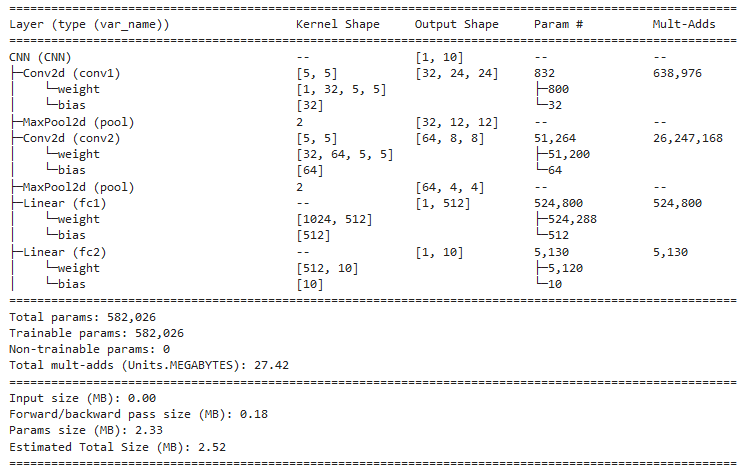

## Implimented Algorithm
The algorithm used to replicated the results can be described by the following mathmatical expression as stated in the [paper](https://arxiv.org/abs/1602.05629).

**Algorithm 1: FederatedAveraging**

The $K$ clients are indexed by $k$; $B$ is the local minibatch size, $E$ is the number of local epochs, and $\eta$ is the learning rate.

**Server executes:**

1. Initialize $w_0$
2. for each round $t = 1, 2, ...$ do
   - $m \leftarrow \max(C \cdot K, 1)$
   - $S_t \leftarrow$ (random set of $m$ clients)
   - for each client $k \in S_t$ in parallel do
     - $w_{k,t+1} \leftarrow \text{ClientUpdate}(k, w_t)$
   - $m_t \leftarrow \sum_{k \in S_t} n_k$
   - $w_{t+1} \leftarrow \sum_{k \in S_t} \frac{n_k}{m_t} w_{k,t+1}$

**ClientUpdate(k, w):** Run on client $k$

1. $B \leftarrow$ (split $P_k$ into batches of size $B$)
2. for each local epoch $i$ from 1 to $E$ do
   - for batch $b \in B$ do
     - $w \leftarrow w - \eta \nabla f(w; b)$
3. return $w$ to server

## The Dataset

It should be noted that the training data in the MNIST dataset is used only by the clients and the test data is used to evaluate the global model after each round.

### Independent & Identically Distributed Case

The results that were replicated were done using the MNIST dataset in two different cases. As described in the paper the IID case calls for splitting the dataset up by first shuffling the data and then splitting it up evenly to the 100
clients. This gives each client 600 samples to train on. This allows each client to have an equal chance to get data from each class.

This was achieved by the following line of python code:

```python
traindata_split = torch.utils.data.random_split(traindata, [int(traindata.data.shape[0] / num_clients) for _ in range(num_clients)])
train_loader = [torch.utils.data.DataLoader(x, batch_size=batch_size, shuffle=True) for x in traindata_split]
```
### Non-Independent & Identically Distributed Case

In the non IID case each client would only get examples of two numbers so each client will not have examples of the other 8 numbers in the dataset
In order to simulate this in python the following line of code was used to split up the dataset giving each client their own dataloader.

```python
traindata = datasets.MNIST('./data', train=True, download=True, transform=transform)
target_labels = torch.stack([traindata.targets == i for i in range(10)])
target_labels_split = []
for i in range(5):
    target_labels_split += torch.split(torch.where(target_labels[(2 * i):(2 * (i + 1))].sum(0))[0], int(60000 / num_clients))
    
traindata_split = [torch.utils.data.Subset(traindata, tl) for tl in target_labels_split]
train_loader = [torch.utils.data.DataLoader(x, batch_size=batch_size, shuffle=True) for x in traindata_split]
```
This loops through the sorted dataset which selects groups of numbers [0, 1], [2, 3], [4, 5], [6,7], and [8, 9]
## Results

The model was evealuated in 4 different cases using a mini-batch size (B=10) of 10, and 5 local epochs (E=5). The client size being 100 where 10 clients are selected each round (C=0.1). In the IID case a learning rate of $\eta = 0.215$ was used.
In the non-IID case a learning rate of $\eta = 0.1$ was used as these learning rates were said to be "optimal". The amount of rounds when traning and evaluating the IID and non-IID cases. The results of the IID case match those found in the [reasearch paper](https://arxiv.org/abs/1602.05629).

### IID Loss
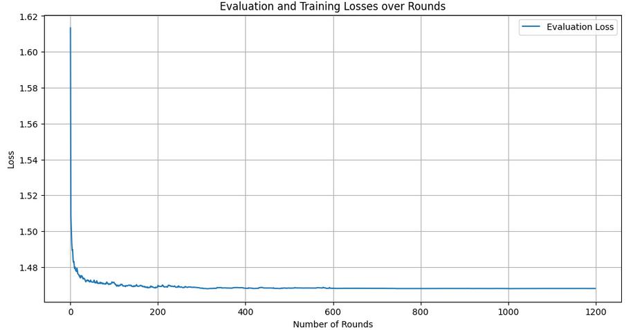

### IID Accuracy
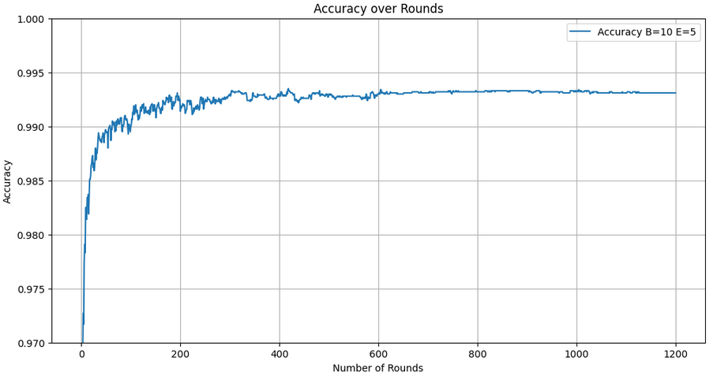 

### Non-IID Accuracy
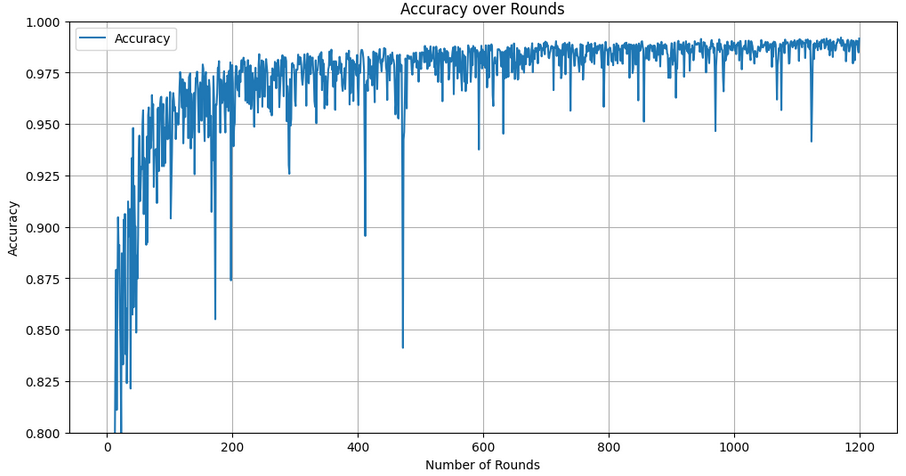

In the IID case it can be concluded that the model comes to a stable accuracy over each round and "stabilizes" after 600 rounds. In the non-IID case the model accuracy has a much larger variance but seems to come to a similar accuracy seen in the the IID case.

### Comparing Schedulers

When referring to a random scheduler the selection of clients is completely random as defined in the following code snippet:

```python
client_idx = np.random.permutation(num_clients)[:num_selected]
    # client update
    loss = 0
    # Go through the selected clients
    for i in range(num_selected):
        loss += client_update(client_models[i], opt[i], train_loader[client_idx[i]], epochs=epochs)
```

This selects and trains each client at random.

When using an age based scheduler (ABS) each client is still chosen at random but the age of each client is kept track of. The clients that are older are given a larger probability of being selected to be used for a round of training. Even though the clients are still selected at random, there is a bias to select clients that have an older age. This is done in the following code snippet:

```python
client_idx = np.random.choice(num_clients, size=num_selected, replace=False, p=probabilities)
    # Update client age
    client_age += 1
    client_age[client_idx] = 0  # Reset age for selected clients
    # Client update
    loss = 0
```
### Evaluation and Training Losses

For this section the models were trained over less rounds as they come to a conclusion in around 250 to 400 rounds of training. The following loss graph compares the IID case comparing the ABS and random scheduling.

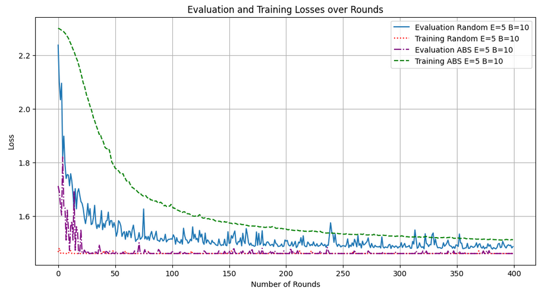

It can be seen that even though the ABS takes longer to get to a loss it is a "smoother" graph. This can be seen even more when comparing the accuracy of the non-IID and IID cases.

### IID and Non-IID Accuracy

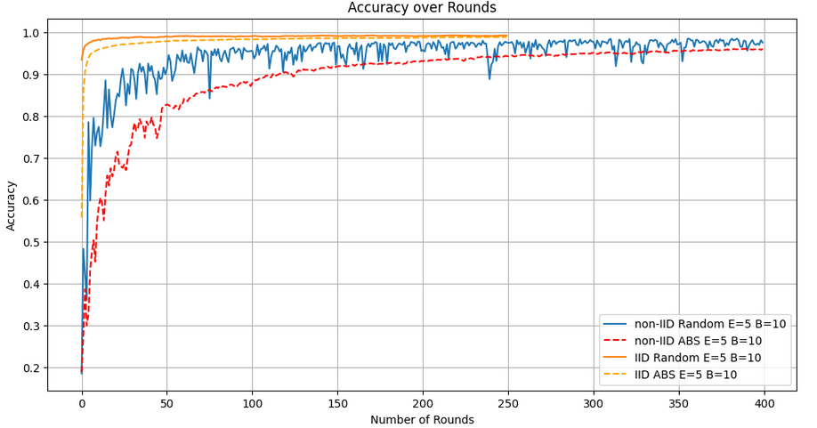

In the non-IID case the accuracy has a lower variance and a smoother accuracy curve. This comes at a cost of having to train the model over a larger amount of rounds.

## Conclusion
In conclusion the results from the research were able to be replicated. Both the IID and Non-IID cases were tested using different schedulers (Random and Age Based). In the Non-IID case the model was able to reach a conclusion faster by picking clients at random. When using an age based scheduler the gobal model still reaches a similar accuracy as in the random case. The accuracy curve is seen to be smoother using the ABS as opposed to the random scheduler.

## References
-[Communication-Efficient Learning of Deep Networks from Decentralized Data](https://arxiv.org/abs/1602.05629)

-[Federated Learning Using Pytorch](https://github.com/yonetaniryo/federated_learning_pytorch/blob/master/FL_pytorch.ipynb)

-[Age-Based Scheduling Policy for Federated Learning in Mobile Edge Networks](https://arxiv.org/abs/1910.14648)

## CIFAR-10 Dataset
 Next the CIFAR-10 dataset was used to introduce more compexities into the network.
 Two networks were tested along with two different optimizers, two different client selection amounts.
 The two optimizers used were the SGD optimizer with a learning rate of 0.21 and the Adam optimizer with a learning rate of 0.0001.
 Each model was trained over 300 rounds over 5 epochs for client training.
 
### The Two CNN Models Used:
Here is the network architecture of the two different CNN's:

#### "Larger" CNN
```python
  # Define the CNN model
  class CIFARCNN(nn.Module):
      def __init__(self):
          super(CIFARCNN, self).__init__()
          self.conv1 = nn.Conv2d(3, 32, kernel_size=3, padding=1)
          self.conv2 = nn.Conv2d(32, 64, kernel_size=3, padding=1)
          self.conv3 = nn.Conv2d(64, 64, kernel_size=3, padding=1)
          self.pool = nn.MaxPool2d(2, 2)
          self.flatten = nn.Flatten()
          self.fc1 = nn.Linear(64 * 4 * 4, 64)  # Assuming input size after max pooling is 4x4 and output size of dense layer is 64
          self.fc2 = nn.Linear(64, 10)
          
      def forward(self, x):
          x = F.relu(self.conv1(x))  
          x = self.pool(x)  
          x = F.relu(self.conv2(x))  
          x = self.pool(x)  
          x = F.relu(self.conv3(x))  
          x = self.pool(x)
          x = self.flatten(x)  # Flatten the output
          x = F.relu(self.fc1(x))  # Apply dense layer with relu activation
          x = self.fc2(x)  # Apply final dense layer
          return x
```

##### "Smaller" CNN

```python
  class SmallerCIFARCNN(nn.Module):
    def __init__(self):
        super(SmallerCIFARCNN, self).__init__()
        self.conv1 = nn.Conv2d(3, 16, kernel_size=3, padding=1)
        self.conv2 = nn.Conv2d(16, 32, kernel_size=3, padding=1)
        self.pool = nn.MaxPool2d(2, 2)
        self.fc1 = nn.Linear(32 * 8 * 8, 64)  # Adjust the input size accordingly
        self.fc2 = nn.Linear(64, 10)
        
    def forward(self, x):
        x = F.relu(self.conv1(x))  
        x = self.pool(x)  
        x = F.relu(self.conv2(x))  
        x = self.pool(x)  
        x = x.view(-1, 32 * 8 * 8)  # Adjust the shape accordingly
        x = F.relu(self.fc1(x))
        x = self.fc2(x)
        return x
```
### Client Selection of 10 Losses

Here are the loss results for the different optimizers, networks with the new dataset 10 clients per round::

#### "Larger" Network

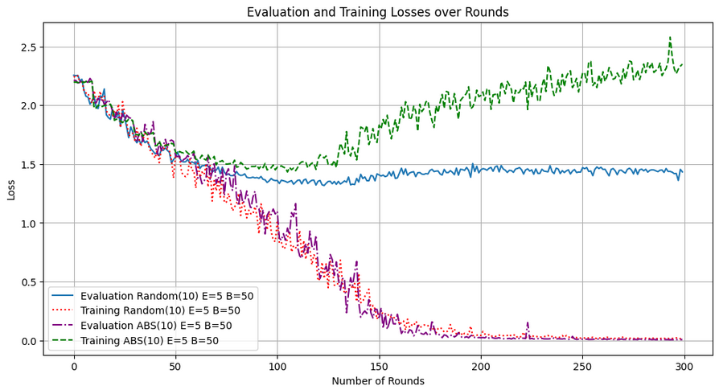

#### "Smaller" Network

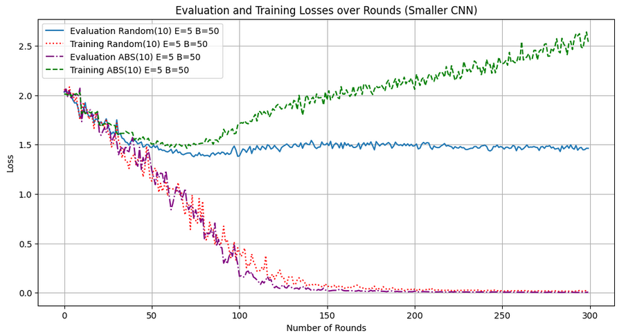

### Client Selection of 10 Accuracy

Here are the accuracy results for the different optimizers, networks with the new dataset 10 clients per round::

#### "Larger" Network

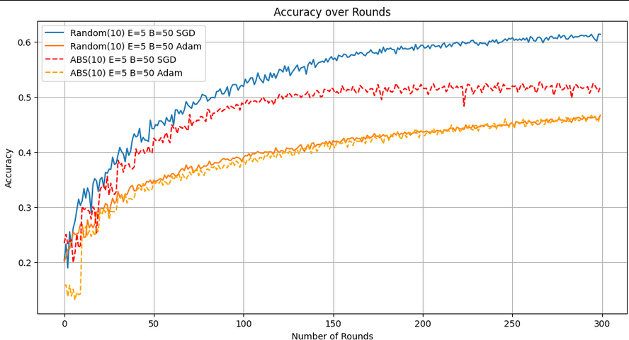

#### "Smaller" Network

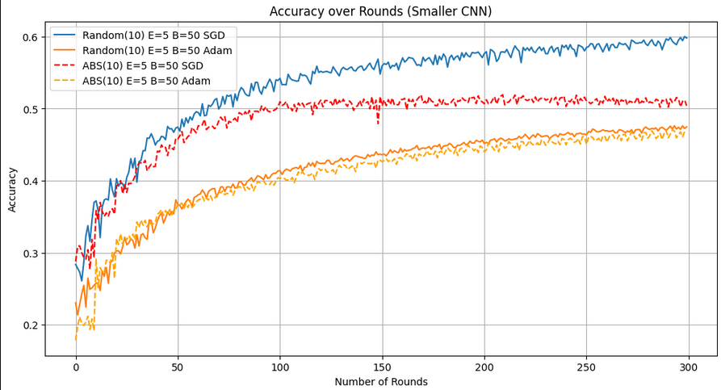

===================

### Client Selection of 5 Losses

Here are the loss results for the different optimizers, networks with the new dataset only choosing 5 clients per round:

#### "Larger" Network

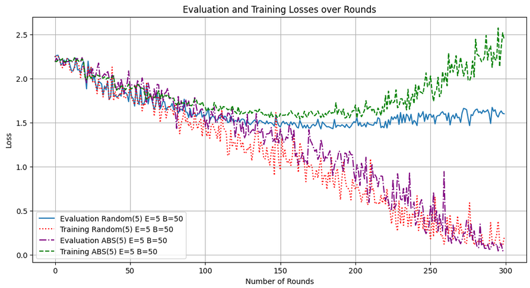

#### "Smaller" Network

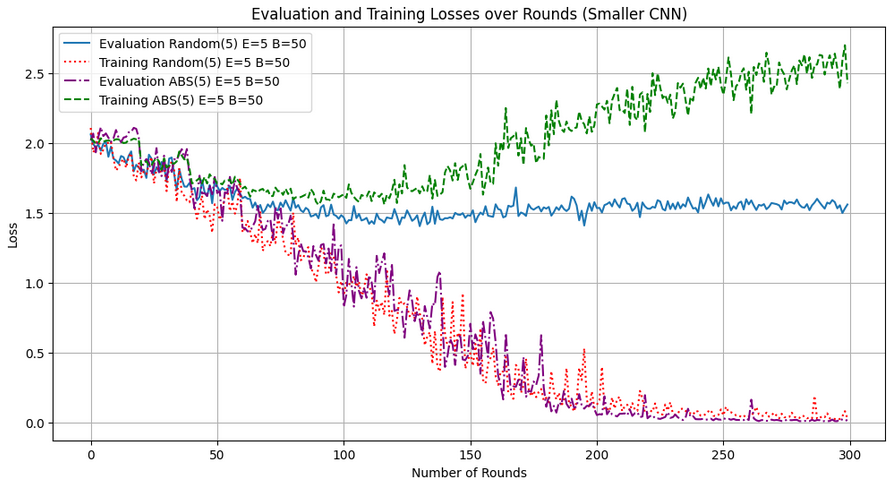

### Client Selection of 5 Accuracy

Here are the accuracy results for the different optimizers, networks with the new dataset 5 clients per round:

#### "Larger" Network

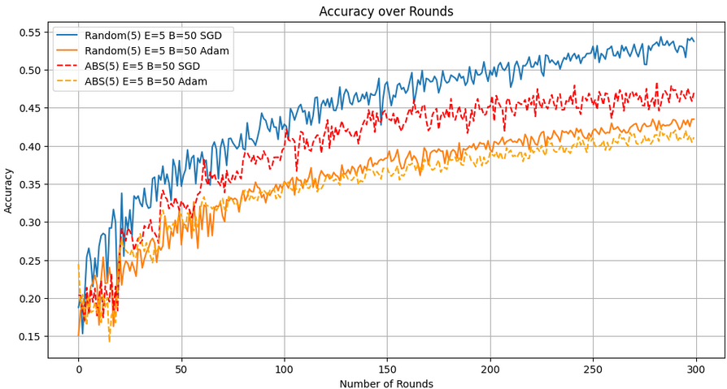

#### "Smaller" Network

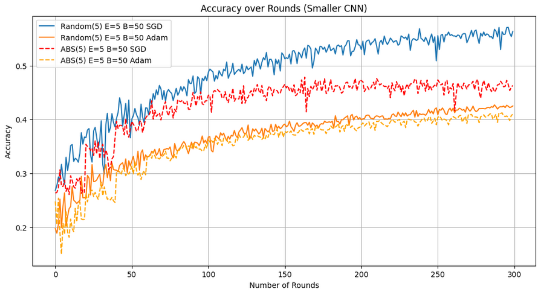


